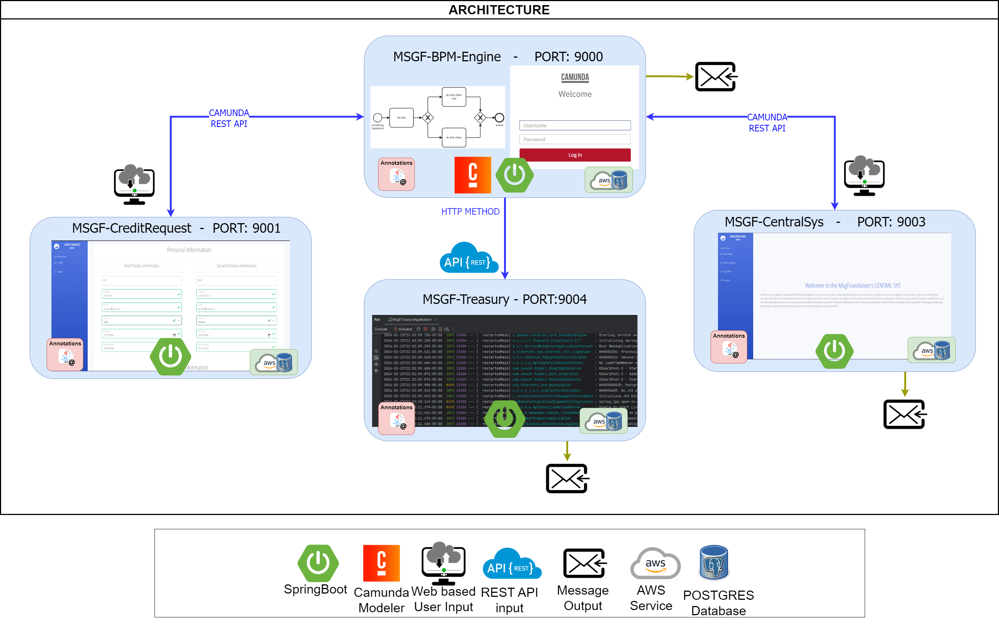

#  MSGF-hub

This is a monorepository that contains an example of a Business Process based System, the MSG-Foundation case study from the book "Object-Oriented and Classical Software Engineering" (Stephen R. Schach. 2010).

The MSG Foundation grants mortgage credits to couples for the purchase of their house, so the system implements the application for these credit requests. The foundation's name refers to the acronym of its founder and philanthropist Martha Stockton Greengage.

## Index

1. [Description](#description)
2. [Applications](#applications)
3. [Technologies](#technologies)
4. [Installation requirements](#installation-requirements)
5. [Usage](#usage)


## Description

This development was carried out with two objectives:

* Obtain the set of software artifacts that make up an information system based on business processes, using the Camunda machine as a process engine. (in its community 7 version).  

* Use this information system to apply a traceability scheme that facilitates its evolution. This scheme is based on annotations and is found in [GitHub Repository](https://github.com/BPMN-sw-evol/Annotations).

The different components shown in the following architecture are hosted here:




## Applications

1. **BPM-Engine**: program that integrates the Camunda process engine in its version 7 in a Spring Boot project persisting the whole schema to a PostgreSQL database. [Repository Link](https://github.com/BPMN-sw-evol/MSGF-BPM-Engine)

2. **CreditRequest**: program that manages all credit requests from customers. There you can create a new request and follow up on it. [Repository Link](https://github.com/BPMN-sw-evol/MSGF-CreditRequest)

3. **CentralSys**: program that manages all credit requests from customers at the organization level. This is where the organization's employees follow up on their assigned tasks. [Repository Link](https://github.com/BPMN-sw-evol/MSGF-CentralSys)

4. **Treasury**: program that manages the financial movements when a credit request is approved by the treasury office. [Repository Link](https://github.com/BPMN-sw-evol/MSGF-Treasury)

5. **annotations**: as part of the business process variable traceability project, some customized annotations were implemented in order to identify how these variables are traced in the source code. Here is the definition of the annotations using a Java project. [Repository Link](https://github.com/BPMN-sw-evol/Annotations)

## Technologies

The applications created in this implementation were developed using the Java programming language, mainly taking advantage of the Spring Boot development framework as well as the Camunda 7 platform for business process management.

[Spring initializr](https://start.spring.io/) is a tool that streamlines the creation of Spring Boot projects by integrating various dependencies such as Spring Data JPA, Spring Web, Lombok, Thymeleaf, and DevTools. Spring Boot improves the development process by providing out-of-the-box solutions for common challenges, allowing developers to focus on business logic rather than infrastructure configuration.

In addition, [Camunda Platform 7](https://camunda.com/platform-7/) has been used for the design and implementation of business processes. Camunda is an open source workflow and decision automation platform based on the BPMN (Business Process Model and Notation) and DMN (Decision Model and Notation) standards. It offers powerful workflow management capabilities, allowing organizations to effectively model, automate and optimize business processes. Camunda's flexible and scalable architecture makes it suitable for a wide range of use cases, from automating simple tasks to complex enterprise workflows.

## Installation requirements

To use this program you need the following:

1. **Version control system**: Install GIT from the [GIT official website](https://git-scm.com/downloads).

2. **IntelliJ IDEA**: To run and/or modify the project, you can download it from the [IntelliJ official website](https://www.jetbrains.com/es-es/idea/download/?section=windows).

3. **Docker and Docker-Compose**: To use Docker correctly follow the steps below:
   - Step 1: Install Docker from the official website.(If you already have Docker Desktop installed, skip this step).
   - Step 2: Create a Docker Hub account from the official website, and log in to Docker Desktop. (If you already have an account, log in directly to Docker Desktop) WSL2: According to your need: Use the following command to install WSL2 wsl --list --o to know the available distributions. wsl --install -d "distribution-version" to install WSL2 with a specific distribution. Use the following command for upgrade to WSL2 wsl --version if you want to know the installed WSL version wsl --set-default-version 2 to change the version to WSL2.

4. **Java**: Install Jaca from the [official website](https://www.oracle.com/java/technologies/javase/jdk17-archive-downloads.html).
   - Step 1: Download MSI installer version.
     
5. **Maven**: Install Apache Maven from the [official website](https://maven.apache.org/download.cgi).
   - Step 1: Add the **bin** folder path to the environment variables.

## Usage

To use this program you must:

1. Verify that the Docker daemon is running.

2. Open a terminal in the folder where you want to download the program and clone it with:

   ```
   git clone https://github.com/BPMN-sw-evol/trace-hub.git
   ```

3. You should run the build-and-run.sh file as follows (if you are on a Windows operating system use Git Bash):

   ```
   ./build-and-run.sh
   ```

4. Wait a moment while the images and containers are built and the services are launched. This depends on your computing power.
   
5. You are done! After that you can interact with the MSG-Foundation systems. 

   * BPM-Engine works on port 9000.
   * CreditRequest works on port 9001.
   * CentralSys works on port 9002.
   * Treasury works on port 9004.

In this [doc guide](https://docs.google.com/document/d/1DMgXXMgYQpu_NR9twUyS1QT8QMNe5Xy2/edit?usp=sharing&ouid=101566600789219917918&rtpof=true&sd=true) you can find out how to use the MSGF-hub application.  
